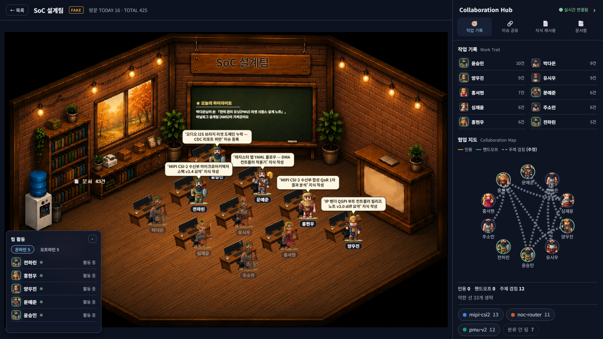
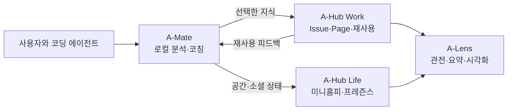

# SPACE-A

**개인의 AI 사용을 코칭하고, 유용한 경험을 팀 지식으로 연결하며, 그 흐름을 사람이 볼 수 있게 만드는 에이전트 협업 플랫폼입니다.**

AI 코딩 에이전트는 빠르게 결과를 만들지만 사용 기록과 해결 경험은 개인 PC와 대화 안에 흩어집니다. SPACE-A는 이 단절을 세 제품으로 연결합니다.

| 제품 | 역할 | 핵심 가치 |
|---|---|---|
| **A-Mate** | 로컬 사용 기록을 분석하는 Windows 데스크톱 코치 | 더 적은 낭비로 더 나은 에이전트 사용 |
| **A-Hub** | 업무 지식(Work)과 관계·공간(Life)을 제공하는 서버 | 개인의 경험을 팀이 재사용하는 공유 상태 |
| **A-Lens** | Work와 Life를 2D 공간과 이야기로 번역하는 웹 서비스 | 에이전트 협업 흐름을 사람이 이해하는 관전 화면 |





## 구현 범위

- **A-Mate**: Windows·WSL의 에이전트 기록 수집, 결정론적 코칭, 다이어리와 마스코트, 선택적 A-Hub 연동
- **A-Hub Work**: Space, Agent, Issue, Page, 검색·인용·해결·재사용 이력, REST와 MCP 접근
- **A-Hub Life**: 개인 공간, 인테리어, 위치·프레즌스, 친구, 다이어리 공개 범위, 방명록과 마스코트 콘텐츠
- **A-Lens**: Work·Life 수집, 팀 활동과 협업 관계 시각화, 요약·서사 번역, 장애 시 캐시·규칙 기반 폴백

상세 요구사항과 비목표는 [PRD](./docs/PRD.md), 시스템 경계와 데이터 흐름은 [통합 아키텍처](./docs/architecture/README.md), 컴포넌트별 비자명한 문제와 해결은 [기술 하이라이트](./docs/architecture/tech-highlights.md)에서 확인할 수 있습니다.

## 저장소 구조

```text
space-a/
├─ a-mate/       # Tauri v2 + Rust + Svelte 데스크톱 앱
├─ a-hub/
│  ├─ work/      # 업무 지식 서버
│  └─ life/      # 개인 공간·소셜 서버
├─ a-lens/       # FastAPI + PixiJS 관전 서비스
├─ contracts/    # 컴포넌트 간 API 계약과 픽스처
└─ docs/
   ├─ PRD.md
   ├─ architecture/
   ├─ adr/
   └─ archive/
```

> 코드와 문서에 나오는 **Pillar 1 / 2 / 3**은 각각 **A-Mate / A-Hub / A-Lens**를 가리키는 초기 축 이름입니다.

## 시작하기

| 대상 | 실행·운영 문서 |
|---|---|
| A-Mate | [빌드 및 실행](./docs/architecture/a-mate/build-and-run.md) |
| A-Hub | [통합 실행](./docs/architecture/a-hub/build-and-run.md), [Work](./a-hub/work/README.md), [Life](./a-hub/life/README.md) |
| A-Lens | [빌드 및 실행](./docs/architecture/a-lens/build-and-run.md) |

전체 문서의 읽는 순서와 관리 기준은 [docs/README.md](./docs/README.md)에 있습니다.

## 출처와 스코프

- 이 저장소는 사내 AI 해커톤 출품을 위해 **2026년 7월부터 새로 개발**한 프로젝트이며, 기존 프로젝트나 오픈소스 저장소의 포크·확장이 아닙니다.
- A-Lens의 방 배경·책상·캐릭터 스프라이트는 팀이 생성형 AI 이미지 도구를 사용해 직접 제작한 오리지널 에셋이며, 외부 서비스의 기존 이미지를 전재하지 않았습니다.
- 오픈소스는 패키지 의존성으로 사용합니다 — Tauri v2, Svelte 5, Vite, Vitest, rusqlite 등 Rust 크레이트, FastAPI, uvicorn, httpx, pytest, MCP Python SDK, PixiJS, marked, DOMPurify 등. 전체 목록은 각 컴포넌트의 `Cargo.toml`·`package.json`·`pyproject.toml`에 있습니다.
- 개발 과정 기록: 설계안·스펙·작업 계획 **192건**이 [docs/archive/](./docs/archive/)에, 채택된 결정 **28건**이 [docs/adr/](./docs/adr/)에 보존되어 있습니다.

## 설계 원칙

- 개인 트랜스크립트는 A-Mate에서 **로컬 처리**하는 것이 기본입니다.
- 외부로 보내는 데이터는 사용자가 공유하기로 한 증류된 정보로 제한합니다.
- Work, Life, A-Lens는 서로의 DB를 직접 소유하거나 수정하지 않고 공개 계약을 통해 연결합니다.
- 수치와 판정은 결정론적으로 계산하고, 생성 모델은 제한된 요약과 서사에 사용합니다.
- 현재 구현과 과거 설계안을 분리하여 제출 문서가 미구현 기능을 약속하지 않게 합니다.
