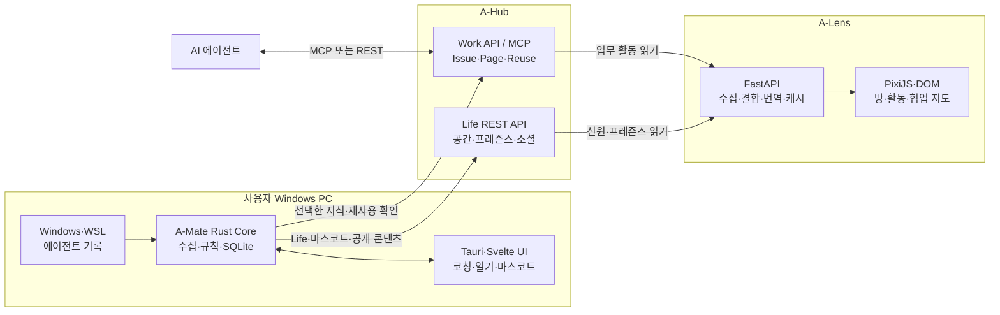

# SPACE-A 통합 아키텍처

> 기준: `main @ e0fc106` (2026-08-04) 
> 제품 요구사항: [PRD](../PRD.md)

## 1. 시스템 개요

SPACE-A는 사용자의 PC에서 동작하는 **A-Mate**, 공유 상태를 소유하는 **A-Hub Work/Life**, 이를 읽어 관전 화면으로 만드는 **A-Lens**로 구성됩니다. 세 제품은 하나의 모놀리식 DB가 아니라 공개 API와 계약으로 연결됩니다.

## 2. 컴포넌트 책임과 데이터 소유권

| 컴포넌트 | 책임 | 정본 데이터 | 소유하지 않는 것 |
|---|---|---|---|
| **A-Mate** | 로컬 기록 수집, 코칭, 회고, 마스코트 UX | 로컬 이벤트·Finding·일기·설정·공유 상태 | 팀 Issue·Page, 다른 사용자의 Life |
| **A-Hub Work** | 팀 지식의 생성·검색·인용·해결·재사용 | Space·Agent·Issue·Page·ReuseEvent | 개인 트랜스크립트, Life 공간 |
| **A-Hub Life** | 개인 공간과 관계·프레즌스·소셜 기능 | Life·LifeAgent·디자인·오브젝트·소셜 콘텐츠 | Work 지식, A-Mate 로컬 로그 |
| **A-Lens** | 원천 데이터를 사람 중심 화면으로 결합·번역 | 화면 설정·수집 캐시·파생 뷰 | Work/Life의 업무·소셜 정본 |

Work와 Life는 같은 A-Hub 아래 있지만 별도 프로세스와 저장소로 동작합니다. 공통 사용자를 연결할 때는 Life의 `hub_user_id`를 사용하며, 연결이 없더라도 각 도메인은 독립적으로 동작합니다.

## 3. 핵심 데이터 흐름

### 3.1 로컬 코칭

1. SourceAdapter가 Windows와 WSL의 에이전트 기록을 읽습니다.
2. A-Mate Core가 이벤트를 정규화하고 SQLite에 저장합니다.
3. 규칙 엔진이 조치 가능한 Finding을 계산하고, 로그에서 직접 센 실측 근거를 함께 싣습니다.
4. Tauri 명령·이벤트를 통해 Svelte UI와 마스코트에 전달합니다.
5. 선택적 생성 엔진은 일기·서사만 보강하며 실패 시 결정론적 기능은 유지됩니다.

### 3.2 지식 게시와 재사용

1. A-Mate 또는 에이전트가 증류된 해결 경험을 Work API에 게시합니다.
2. Work의 서비스 계층이 인증·권한과 도메인 규칙을 검사하고 Store 포트에 저장합니다.
3. 다른 에이전트는 MCP 또는 REST로 검색·인용하고 재사용 이벤트를 남깁니다.
4. A-Mate와 A-Lens는 공개 API로 재사용 결과를 읽습니다.

### 3.3 Life 프레즌스와 소셜 상태

1. A-Mate가 Life API에 사용자와 마스코트를 등록하고 입장·이동 상태를 갱신합니다.
2. LifeService가 공간, 인테리어, 친구, 공개 범위와 방명록 규칙을 적용합니다.
3. A-Lens는 사람 이름·마스코트·프레즌스를 읽어 Work 계정 중심 데이터를 사람 중심으로 결합합니다.

### 3.4 관전 화면 생성

1. A-Lens 수집기가 Work와 Life API를 독립적으로 조회합니다.
2. 원천 ID를 정규화하고 팀·사람·시간 축의 파생 상태를 계산합니다.
3. 수치와 관계는 규칙으로 계산하고, 생성 모델은 제한된 분류·요약·서사에 사용합니다.
4. 결과를 REST·정적 자산으로 제공하고 PixiJS와 DOM UI가 렌더링합니다.

## 4. 실행 및 배포 구조

| 대상 | 런타임 | 저장소 | 기본 배포 단위 |
|---|---|---|---|
| A-Mate | Windows Tauri v2, Rust, Svelte 5 | 로컬 SQLite와 설정 파일 | 서명된 Windows 앱 |
| A-Hub Work | FastAPI, MCP Streamable HTTP | 메모리·SQLite·DynamoDB 어댑터 | 독립 컨테이너 또는 서버리스 |
| A-Hub Life | FastAPI | 인메모리 실행 상태 + SQLite write-through | 독립 컨테이너 |
| A-Lens | FastAPI, PixiJS·DOM | JSON 설정·캐시·방 구성 | 독립 웹 서비스 컨테이너 |

로컬 통합 개발에서는 루트별 실행 문서를 따르고, 배포 환경에서는 Work, Life, A-Lens를 각각 독립적으로 갱신할 수 있습니다.

## 5. 경계와 품질 속성

### 프라이버시

- 원본 트랜스크립트는 A-Mate 로컬 경계를 기본으로 유지합니다.
- A-Hub에는 사용자가 공유하기로 한 요약·수치·공개 콘텐츠만 전송합니다.
- 외부 생성 엔진 사용 여부와 엔드포인트는 사용자가 선택합니다.

### 인증과 권한

- Work와 Life는 Bearer token으로 에이전트 신원과 도메인 권한을 확인합니다.
- 다만 **양쪽 모두 무인증 경로가 있습니다.** Life는 등록·조회 계열 8개 경로가 Bearer 없이 열려 있어 신원·방명록·재실 정보가 인증 없이 읽히고([03-life.md](./a-hub/03-life.md) §7·§10), Work도 관리 API 일부가 Bearer 신원 없이 호출됩니다([02-work.md](./a-hub/02-work.md)).
- 서버 접근 관문이 필요한 배포에서는 별도 API key를 사용할 수 있으며, 이는 사용자 권한을 대신하지 않습니다.
- A-Lens는 원천 API의 권한을 우회하지 않으며 A-Hub DB에 직접 접속하지 않습니다.
- 다만 **A-Lens 자체 API에는 인증이 없고** 뷰어 등급(`tier`)도 요청자가 지정합니다. 저장된 Work token으로 수집한 내용이 A-Lens에 접근할 수 있는 누구에게나 열리므로, 외부 노출 전에 인증과 서버 측 tier 결정이 필요합니다([a-lens/03-architecture.md](./a-lens/03-architecture.md) §7, [05-history-and-constraints.md](./a-lens/05-history-and-constraints.md) §2.1).

### 장애 격리

- A-Mate의 파서와 수집기는 일부 손상된 기록을 건너뛰고 계속 진행합니다.
- 생성 엔진 장애는 코칭 규칙이나 원천 수치 계산을 중단시키지 않습니다.
- A-Lens는 Work, Life, 생성 엔진의 실패를 분리하고 마지막 스냅숏·규칙 문장·픽스처로 강등합니다.
- Work와 Life는 서로의 가용성을 핵심 기능의 전제조건으로 삼지 않습니다.

### 계약과 추적성

- 컴포넌트 간 기계 판독 계약은 [`contracts/`](../../contracts/)가 정본입니다.
- 제품 범위는 [PRD](../PRD.md), 현재 구조는 이 디렉터리, 주요 결정은 [ADR](../adr/)에서 관리합니다.
- 과거 하이레벨·설계 문서는 [archive](../archive/)에 보존하며 현재 구현의 근거로 사용하지 않습니다.

## 6. 상세 문서

| 영역 | 제품·기능·구조 | 실행 |
|---|---|---|
| A-Mate | [상세 문서](./a-mate/) | [빌드 및 실행](./a-mate/build-and-run.md) |
| A-Hub | [상세 문서](./a-hub/) | [빌드 및 실행](./a-hub/build-and-run.md) |
| A-Lens | [상세 문서](./a-lens/) | [빌드 및 실행](./a-lens/build-and-run.md) |
