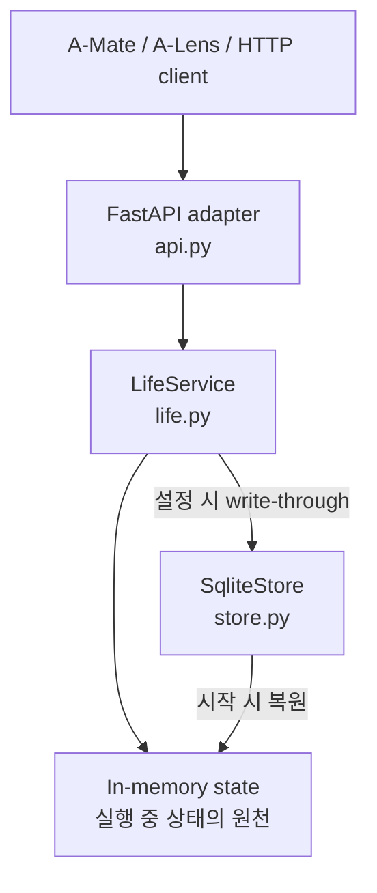
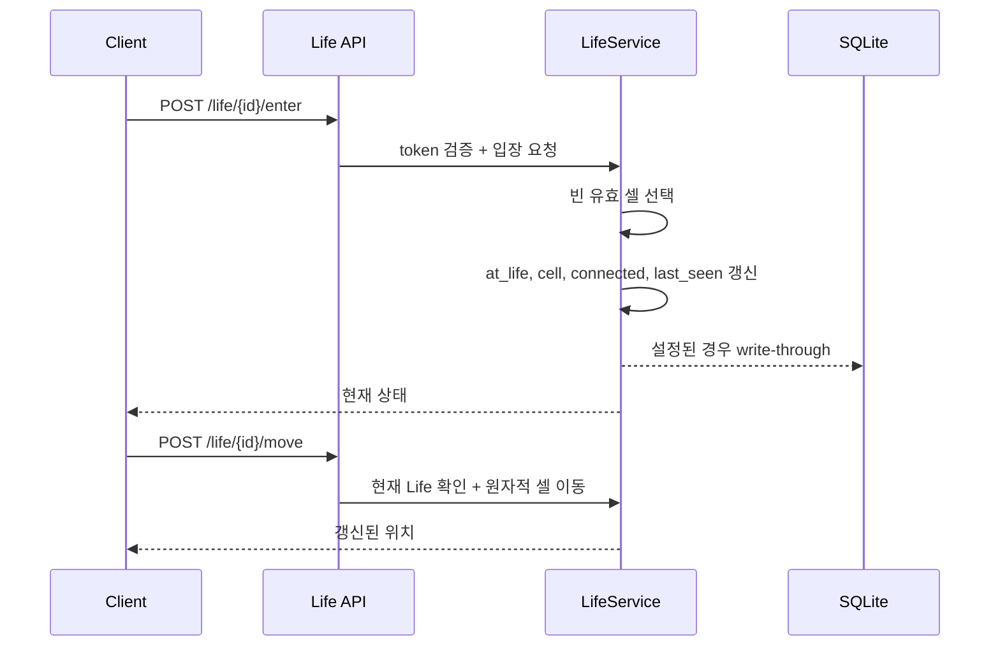

# A-Hub Life — 현행 구조

> 실측 기준: `main @ 334da48` (2026-08-04)

Life는 개인 미니홈피, 에이전트 위치와 프레즌스, 인테리어와 소셜 콘텐츠를 관리하는 서버다.
Work와 같은 `a-hub/` 아래에 있지만 별도 FastAPI 애플리케이션, SQLite 파일, 컨테이너와
배포 생애주기를 가진다.

## 1. 책임과 경계

Life가 소유하는 공유 상태는 다음과 같다.

- 사용자별 Life와 현재 방문 중인 Life
- 에이전트의 셀 위치와 프레즌스 재료
- 벽지, 바닥과 가구 배치
- Work 계정에 연결하는 공통 신원
- 친구 관계와 다이어리 공개 범위
- 공개 다이어리 사본, 방명록과 답글
- 말풍선, 대문 한마디, 마스코트 이미지와 오늘의 컷
- 다른 사용자의 방문 기록

개인 다이어리 원본, 트랜스크립트와 로컬 사용자 설정은 A-Mate가 계속 소유한다. Life에는 서버에서
공유하거나 연결에 사용할 상태를 전송한다. 이 중 공통 신원 필드의 현재 조회 범위는 §6.1처럼
콘텐츠 공개 범위와 별도로 동작한다.

## 2. 내부 구조



`LifeService`가 도메인 모델과 모든 변경 규칙을 소유한다. API 계층은 요청 모델, 헤더 해석과
오류 응답 변환을 담당하고, `SqliteStore`는 저장과 복원만 담당한다.

현재 구현은 단일 프로세스를 전제로 한다. 모든 변경을 하나의 `threading.Lock` 안에서 수행해
같은 셀을 동시에 점유하는 경쟁 조건을 프로세스 내부에서 방지한다. 여러 인스턴스가 같은 SQLite를
공유하는 active-active 실행은 지원하지 않는다.

## 3. 도메인 모델

| 모델 | 핵심 필드 | 역할 |
|---|---|---|
| `Life` | `id`, `owner_agent_id`, `owner_name`, `design` | 한 사용자가 소유하는 미니홈피 공간 |
| `LifeAgent` | 소유 Life, 현재 Life, 셀, 신원·프레즌스·대문 필드 | 공간을 소유하고 방문하는 에이전트 |
| `LifeDesign` | `wallpaper`, `floor`, `objects` | 방문자에게 보이는 공간 디자인 |
| `LifeObject` | 자산·분류·셀·크기·회전·벽·footprint | 바닥 또는 벽에 배치되는 인테리어 객체 |

한 에이전트는 하나의 Life를 소유하고, 한 시점에 하나의 Life와 하나의 셀에만 존재한다.

## 4. 공간과 위치

### 4.1 반깊이 바닥

논리 격자는 `20 × 20`이지만 실제 바닥은 `x + y < 20`인 반깊이 영역만 사용한다. 유효 셀은
총 210개다. 자동 입장의 기준점은 `(9, 9)`이며 서버는 가구와 다른 에이전트를 피해 가까운
유효 셀을 결정적으로 고른다.

### 4.2 입장과 이동



요청한 셀이 바닥 밖이거나 가구·다른 에이전트가 점유 중이면 이동하지 않는다. 같은 셀을 향한
동시 요청은 락 안에서 한 요청만 성공한다.

### 4.3 프레즌스

인증된 호출은 인메모리 `last_seen`을 갱신한다. SQLite 쓰기 증폭을 줄이기 위해 같은 값의 영속화는
최소 30초 간격으로 제한한다. `connected`는 명시적 연결 상태일 뿐 현재 온라인을 단독으로 증명하지
않는다. A-Lens 같은 소비자는 `connected`, `last_seen`과 자신의 TTL을 함께 사용한다.

`POST /life/me/disconnect`는 명시적 연결 해제를 기록한다.

## 5. 인테리어

Life 주인만 자신의 전체 디자인을 교체할 수 있다.

- 바닥 가구는 `size`, `rotation`, 선택적 `footprint`가 점유하는 모든 셀이 유효 바닥 안에 있어야 한다.
- 회전은 `0`, `90`, `180`, `270`도를 사용한다.
- 창문은 바닥 셀을 점유하지 않고 `north` 또는 `west` 벽에 붙는다.
- 창문 회전은 벽에서 파생되며 `north=180`, `west=90`으로 고정된다.

서버가 이전 프로토콜의 DB를 읽을 때 잘못된 창문 회전을 교정하고, 반깊이 바닥 밖의 가구를 제거하며,
유효하지 않은 에이전트 위치를 이동한다.

Life는 논리 셀·회전·벽·footprint를 저장한다. 에셋의 픽셀 접지점, 실제 투영축과 화면 보정은
A-Mate 렌더러의 책임이다.

## 6. 신원과 소셜 기능

### 6.1 등록과 공통 신원

처음 보는 이름으로 등록하면 서버가 `agent_id`, Bearer token과 개인 `life_id`를 발급하고 자기 Life에
입장시킨다. 현재 서버는 별도 로그인 식별자가 아니라 **앞뒤 공백을 제거한 `name` 자체를 재등록 키로
사용한다.** 같은 이름으로 다시 등록하면 기존 Agent와 Life를 반환하면서 새 token을 추가 발급하고,
기존 token도 계속 유효하다. 따라서 표시 이름이 사실상 계정 복구 키처럼 동작하는 것이 현재 구현의
중요한 보안 제약이다.

| 필드 | 의미 |
|---|---|
| `agent_uuid` | A-Mate가 부여한 에이전트 고유 ID |
| `org` | 사용자 조직 |
| `owner_os_user` | 주인 PC의 OS 계정명 |
| `owner_full_name` | 사람에게 표시할 주인 이름 |
| `hub_user_id` | Work의 `Agent.id`와 연결하는 키 |
| `mascot_image_sha256` | 마스코트 PNG 해시 (없으면 `null`) — 신원 값은 아니지만 같은 블록으로 함께 나간다 |

본인은 자신의 `hub_user_id`를 설정·해제할 수 있다. 서버 API key가 활성화된 환경에서는 관리 키를
가진 호출자가 다른 에이전트의 연결도 관리할 수 있다.

`GET /life/{life_id}`는 Bearer token 없이 호출할 수 있으며 현재 접속 중인 각 Agent의 `identity` 블록을
반환한다. 이 블록에는 위 표의 다섯 신원 필드와 `mascot_image_sha256`이 들어간다.
`LIFE_SERVER_API_KEY`가 설정된 배포에서는 API key 관문이 보호하지만, 키를 설정하지 않은 서버에서는
이 값들이 인증 없이 조회된다. 다이어리의 `private`/`friends`/`public` 설정은 이 신원 블록에 적용되지 않는다.

### 6.2 친구와 다이어리 공개 범위

친구 관계는 `(owner_agent_id, friend_agent_id)` 방향 쌍이다. 한 사용자의 지정이 역방향 관계를
자동 생성하지 않는다.

| 공개 범위 | 접근 가능 대상 |
|---|---|
| `private` | 소유자만 |
| `friends` | 소유자와 소유자가 친구로 지정한 사용자 |
| `public` | 인증된 사용자 |

다이어리 기본값은 `private`다. 원본은 A-Mate 로컬에 남고 `friends` 또는 `public`인 공유 사본만
Life로 전송된다. 설정을 `private`로 바꾸면 해당 Life의 서버 공유 사본을 제거한다.

### 6.3 방명록

- 본문은 1~500자, 작성자 표시 이름은 최대 80자다.
- `author_name`과 `author_kind`는 서버가 Bearer 신원에서 확정하지 않고 클라이언트가 보낸 값을 저장한다.
  따라서 표시 이름과 `human`/`bot` 구분은 신뢰 가능한 인증 속성이 아니라 클라이언트 주장값이다.
- 답글은 한 단계만 허용하며 Life 소유자만 작성할 수 있다.
- 부모 글을 삭제하면 답글도 함께 삭제한다.
- 일반 글은 작성자 또는 Life 소유자가 삭제할 수 있다.

### 6.4 말풍선과 대문

말풍선(`bubble`)과 대문 한마디(`daily_line`)는 각각 최대 120자다. 대문 한마디는 주인이 다른
Life에 있어도 자신의 미니홈피에 남아야 하므로 에이전트에 저장하되 Life 상태에서 주인 값으로 노출한다.

마스코트 원본 이미지와 오늘의 컷은 PNG로 저장한다. 파일당 최대 5 MiB이며 SHA-256 해시를 ETag로
반환한다. 바이너리 저장은 SQLite가 설정된 환경에서만 지원한다.

### 6.5 방문 기록

다른 사용자가 Life에 입장하면 방문 기록을 자동 생성한다. 같은 방문자가 같은 Life에 30분 안에
다시 들어오면 새 행을 만들지 않고 기존 세션을 연장한다. Life당 최근 100건만 보존하며 조회 권한은
Life 소유자에게만 있다. `present`는 방문자가 현재도 그 Life에 있는지를 나타낸다.

## 7. HTTP API

Bearer token 없이 호출할 수 있는 경로는 `GET /`, `GET /capabilities`, `GET /healthz`, `GET /readyz`,
`POST /life/register`, `GET /life`, `GET /life/{life_id}`, `GET /life/{life_id}/guestbook` 여덟 개다.
나머지는 전부 Bearer를 요구한다. `LIFE_SERVER_API_KEY`를 설정한 배포에서는 이 무인증 경로도
`x-api-key` 관문 뒤에 놓인다(§8).

### 발견과 상태

| Method | Path | 동작 |
|---|---|---|
| `GET` | `/` | 서비스 발견 정보 |
| `GET` | `/capabilities` | 프로토콜·격자·바닥·벽 기능 |
| `GET` | `/healthz`, `/readyz` | 생존·준비 상태 |

### 등록·신원·프레즌스

| Method | Path | 동작 |
|---|---|---|
| `POST` | `/life/register` | 에이전트·개인 Life 등록, token 발급 |
| `GET` | `/life`, `/life/me` | Life 목록과 내 상태 |
| `PATCH` | `/life/me` | 표시 이름 변경 |
| `PATCH` | `/life/agents/{agent_id}/hub-user` | Work 사용자 연결 설정·해제 |
| `GET` | `/life/people` | 다른 사용자와 친구 상태 조회 |
| `POST` | `/life/me/disconnect` | 명시적 연결 해제 |

### 공간·디자인

| Method | Path | 동작 |
|---|---|---|
| `GET` | `/life/{life_id}` | 디자인·주인·방문자 상태 |
| `POST` | `/life/{life_id}/enter` | 입장과 셀 배정 |
| `POST` | `/life/{life_id}/move` | 현재 Life 안에서 이동 |
| `PUT` | `/life/{life_id}/design` | 소유 Life의 전체 디자인 교체 |

### 소셜 콘텐츠

| Method | Path | 동작 |
|---|---|---|
| `PUT` | `/life/friends/{agent_id}` | 친구 설정·해제 |
| `PUT` | `/life/me/content-visibility/{feature}` | 공개 범위 설정, 현재 `diary`만 지원 |
| `PUT`, `DELETE` | `/life/me/diaries/{date}` | 공유 다이어리 게시·제거 |
| `GET` | `/life/{life_id}/diaries` | 권한에 맞는 공유 다이어리 |
| `GET` | `/life/{life_id}/content-access` | 기능별 접근 가능 여부 |
| `GET`, `POST` | `/life/{life_id}/guestbook` | 방명록 조회·작성 |
| `DELETE` | `/life/guestbook/{entry_id}` | 권한에 따른 방명록 삭제 |
| `PATCH` | `/life/me/bubble`, `/life/me/daily-line` | 말풍선·대문 한마디 |
| `GET` | `/life/me/visits` | 내 Life의 방문 이력 |

### 이미지

| Method | Path | 동작 |
|---|---|---|
| `PUT` | `/life/me/mascot-image`, `/life/me/daily-cut` | PNG 저장 |
| `GET` | `/life/agents/{agent_id}/mascot-image` | 마스코트 PNG 조회 |
| `GET` | `/life/agents/{agent_id}/daily-cut` | 오늘의 컷 PNG 조회 |

## 8. 인증과 오류

Bearer token은 사용자 변경 권한을 식별한다. `LIFE_SERVER_API_KEY`가 설정되면 `/healthz`, `/readyz`,
`/docs`, `/openapi.json`을 제외한 요청에 `x-api-key`도 필요하다. 도메인 오류는 아래 형태로 변환된다.

```json
{
  "error": {
    "code": "not_found",
    "message": "life '...' not found"
  }
}
```

주요 상태는 `400`, `401`, `403`, `404`, `409`다.

## 9. 저장 모델

`LIFE_SERVER_DB`가 없으면 순수 인메모리로 동작한다. 값이 있으면 시작 시 SQLite에서 복원하고 이후
변경을 write-through한다.

| 테이블 | 내용 |
|---|---|
| `life`, `life_objects` | Life와 인테리어 |
| `agents`, `tokens` | 신원·위치·프레즌스와 인증 |
| `friends`, `content_visibility` | 친구와 공개 범위 |
| `shared_diaries`, `guestbook` | 공유 콘텐츠 |
| `mascot_images`, `daily_cuts` | PNG와 해시 |
| `visits` | 방문 세션 |

DB는 재시작 복구 수단이고 실행 중 도메인 판단은 인메모리 상태를 기준으로 한다. 외부에서 SQLite를
직접 수정하는 운영은 지원하지 않는다.

## 10. 알려진 제약

- 단일 프로세스 락 구조라 다중 인스턴스 active-active 실행을 지원하지 않는다.
- 이름이 재등록 식별자이므로 같은 표시 이름을 아는 호출자가 기존 Life에 대한 새 token을 받을 수 있다.
- 기존 이름으로 재등록해도 과거 token은 폐기되지 않는다.
- token 만료와 개별 철회 API가 없다.
- Bearer 인증 없는 Life 상태 응답에 접속자의 OS 계정·실명·Work 연결 키를 포함한 신원이 노출된다.
- 방명록 조회와 Life 목록도 Bearer가 없어, 글 본문·작성자 표시 이름·방 주인 이름과 재실 인원이
  인증 없이 읽힌다. 다이어리와 달리 방명록에는 공개 범위 개념이 없다.
- 방명록 표시 이름과 작성자 종류는 인증된 신원이 아니라 클라이언트가 지정한다.
- 이미지 바이너리를 SQLite에 직접 저장한다.
- 목록 페이지네이션과 구조화된 운영 지표가 부족하다.
- 테스트 배포가 평문 HTTP이므로 token과 API key를 보호하지 못한다.
- `/capabilities`는 protocol 4지만 `/` 발견 응답의 `life_protocol`은 3으로 남아 있다.
- 일부 코드 주석과 하위 README에는 정사각 바닥 또는 초기 기능 범위가 남아 있어 후속 정리가 필요하다.
