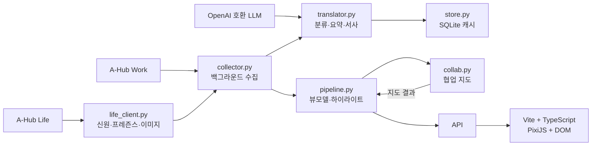

# A-Lens — 현행 아키텍처

> 실측 기준: 2026-08-04

## 1. 전체 구조

브라우저는 A-Hub token이나 API key를 보유하지 않는다. FastAPI만 외부 서비스에 연결하고, 프론트에는 화면에
필요한 뷰모델과 마스코트 프록시 응답을 제공한다.

## 2. 백엔드 모듈

| 모듈 | 책임 |
|---|---|
| `main.py` | FastAPI 라우트, 설정 테스트, 정적 파일·에셋 서빙 |
| `collector.py` | 원천 선택, Work 수집, 더미 병합, Life 사람 결합, 백그라운드 스냅숏 |
| `life_client.py` | Life 사람 목록·신원·프레즌스·마스코트 조회와 TTL 캐시 |
| `translator.py` | LLM 1회 호출과 규칙 분류·요약 폴백. 캐시 판정은 호출자인 `collector.py`가 담당 |
| `pipeline.py` | 로비·방 뷰모델, 권한별 트리밍, 하이라이트 선정과 문장 조립 |
| `collab.py` | 사람 정규화, reuse·handoff·topic 엣지와 프로젝트별 지도 계산 |
| `store.py` | Page·Issue 원문과 번역 결과를 보관하는 SQLite 접근 |
| `settings.py` | 환경 변수와 저장 설정 병합, 비밀 마스킹, 런타임 갱신 |
| `rooms.py` | 프론트가 만든 방 설정을 `rooms.json`에 저장 |
| `room_chat.py` | 창문·정수기 잡담 생성과 내장 폴백 |

## 3. 수집과 응답 경로

수집은 HTTP 요청 스레드에서 수행하지 않는다.

1. 첫 `/api/lobby` 또는 `/api/spaces/{id}` 호출이 단일 백그라운드 갱신 스레드를 시작한다.
2. 디스크에 마지막 `snapshot.json`이 있으면 즉시 화면에 사용한다.
3. 백그라운드 워커가 설정된 주기마다 Work·Life를 수집하고 번역한다.
4. 새 스냅숏을 메모리와 디스크에 원자적으로 교체한다.
5. API 요청은 현재 메모리 스냅숏을 즉시 읽고 `pipeline`이 화면별 뷰모델을 만든다.

빌드는 `_build_lock`으로 직렬화한다. 설정을 저장하면 기존 스냅숏을 버리고 별도 스레드에서 즉시 다시 만든다.

## 4. 프론트 구조

프론트는 프레임워크 없이 TypeScript와 DOM API를 사용한다.

| 위치 | 책임 |
|---|---|
| `main.ts` | 해시 라우팅, 홈·방·사이드바·모달·설정·폴링 |
| `api.ts` | 백엔드 뷰모델 타입과 HTTP 호출 |
| `builder.ts` | 방 만들기·수정 오버레이와 PixiJS 미리보기 |
| `store.ts` | 서버의 공유 방 목록을 메모리에 보관하고 저장 API 호출 |
| `life/renderer.ts` | 방·캐릭터·칠판·상호작용 렌더링 |
| `life/kit.ts` | 스프라이트 킷 로딩과 자산 조회 |
| `life/catalog.ts` | 배경 5종·책상 9종·캐릭터 15종 선택지와 시드 배정 |
| `life/iso.ts` | 아이소메트릭 격자 좌표와 깊이 정렬 |
| `life/types.ts` | 방 설정(`LifeConfig`)과 부품 id 타입 |

라우팅은 `#life/{space_id}` 한 종류와 빈 해시의 홈으로 구성된다. PixiJS는 방 씬에, DOM은 홈·사이드바·설정·모달에
사용한다. 오른쪽 Hub 너비, 접힘, 팀 활동 접힘과 FAKE 표시 여부는 브라우저 `localStorage`에만 저장한다.

## 5. 실패 강등

| 실패 | 동작 |
|---|---|
| Work 연결 실패 (`source=auto`) | 더미 데이터만 표시 |
| 개별 Space 상세 401·403·404 | 해당 상세를 비우고 나머지 Space 수집 계속 |
| Life 미설정·실패 | Work 계정 이름·최근 write 기반 상태 사용 |
| LLM 미설정·실패·형식 오류 | 규칙 카테고리와 본문 기반 요약·내장 잡담 사용 |
| 협업 지도 계산 실패 | 방은 유지하고 `collab=null` 반환 |
| 재시작 직후 원천 수집 지연 | 디스크의 마지막 스냅숏 또는 더미/픽스처 즉시 표시 |
| 마스코트 없음·이미지 로딩 실패 | 스프라이트 킷 캐릭터 15종 중 `agent_id` 시드로 고른 하나를 사용 |
| 스프라이트 킷 로딩 실패 | 절차 생성 도형 캐릭터로 다시 강등 |

## 6. 저장 상태

`backend/.a-lens/`가 기본 상태 디렉터리다.

- `settings.json`: 런타임 설정과 비밀값
- `translation.db`: Page 원문, 번역 결과와 캐시
- `snapshot.json`: 마지막 화면 스냅숏
- `rooms.json`: Space별 방 프리셋 설정

Docker에서는 이 디렉터리를 `alens-data` 볼륨으로 영속화한다. A-Hub의 정본 데이터는 저장하지 않으며,
원천에서 다시 수집 가능한 캐시와 A-Lens 전용 방 설정만 보관한다.

## 7. API 표면

| 메서드·경로 | 역할 |
|---|---|
| `GET /api/health` | 프로세스 상태 확인 |
| `GET /api/lobby` | Space 목록·합계·하이라이트 |
| `GET /api/spaces/{space_id}` | 방 상세와 협업 지도 |
| `GET /api/room-chat` | 창문·정수기 잡담 |
| `GET /api/life-mascot/{agent_id}` | Life 마스코트 PNG 프록시, ETag 지원 |
| `GET/POST /api/settings` | 마스킹된 설정 조회·부분 갱신 |
| `POST /api/settings/test` | Work와 LLM 연결 시험 |
| `GET/POST /api/life` | 공유 방 목록·저장 |
| `DELETE /api/life/{space_id}` | 공유 방 삭제 |

인증은 A-Lens 자체 API에 적용되어 있지 않다. 외부에 노출할 때는 이 점을 운영 경계로 다뤄야 한다.
