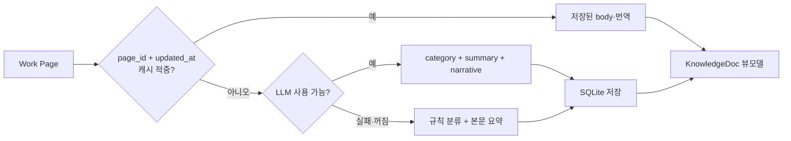

# A-Lens — 데이터 흐름과 연동

> 실측 기준: `main @ fda2467` (2026-08-04)

## 1. 원천 모드

| `A_LENS_SOURCE` | 동작 |
|---|---|
| `auto` | Work 성공 시 실데이터와 더미를 합치고, 실패 시 더미만 사용 |
| `hub` | Work 실데이터만 사용하며 실패를 숨기지 않음 |
| `dummy` | `backend/dummy_data/`의 데모 회사만 사용 |
| `fixtures` | `contracts/fixtures/`의 계약 검증 데이터 사용 |

`auto`에서 실데이터와 더미의 `space_id`가 겹치면 실데이터가 우선한다. 더미 항목에는 `demo=true`를 넣어 프론트가
`FAKE`로 구분한다.

## 2. Work 수집

A-Lens는 현재 Work의 전용 C2 집계 API 하나를 받는 대신 다음 REST 응답을 조합한다.

- `/spaces`
- `/spaces/{id}/tree`
- `/issues?space_id={id}`
- `/spaces/{id}/members`
- `/reuse-events?limit=200`
- Page 본문 상세 조회

Space별 Page·Issue 수, 해결 수와 재사용 수를 집계하고, Page·Issue의 최근 write 시각으로 사람의 최근 활동을 만든다.
개별 상세의 403·404는 인증 지문별로 30분간 기억해 반복 호출을 줄인다. 500과 timeout은 일시 오류로 보고 다음 갱신에
다시 시도한다.

## 3. Life 결합과 공통 신원

Life 연결은 선택 사항이다. 설정되어 있으면 `/life/people`, `/life/me`와 마스코트 이미지 API를 읽는다.

Work 계정을 Life 사람에게 연결하는 우선순위는 다음과 같다.

1. Life `identity.hub_user_id`
2. A-Lens 설정의 `life_alias`
3. Life 이름과 Work ID·이름의 정규화 비교
4. Life `owner_os_user` 정규화 비교

정규화는 소문자화, `a-mate/` 접두어 제거와 공백·점·하이픈·밑줄 제거다. 한 사람에게 여러 Work 계정이 연결되면
화면에서는 대표 한 줄로 합치고 `merged_ids`에 나머지를 보존한다.

프레즌스는 Life 응답에 `last_seen`이 있으면 `connected`와 함께 사용한다. Life가 없거나 구버전이면 Work의 최근 write가
설정된 `presence_window` 안에 있는지로 `working`과 `idle`을 판정한다.

## 4. 번역 파이프라인

LLM은 OpenAI 호환 `/chat/completions`를 사용한다. 카테고리·요약·서사를 JSON 한 번에 요청한다. Page는
같은 `page_id`의 `updated_at`이 바뀌지 않으면 저장된 본문과 번역을 재사용한다. `source_hash`도 저장하지만
현재 캐시 적중 조건으로 사용하지 않는다. 요약 길이를 바꾸면 번역 캐시를 비워 전체를 다시 번역한다.

Issue는 본문이 없으므로 제목을 입력으로 별도 번역하며, `issue_id + title` 기준의 `issue_translation` 캐시를 사용한다.
파생 Page와의 시각 조인은 해결자·handoff를 보정하는 데만 쓰고 번역을 공유하지 않는다. 숫자, 상태, 작성자,
시각과 관계 엣지는 LLM이 만들지 않는다.

## 5. 화면 뷰모델

### 로비

`GET /api/lobby`는 다음을 제공한다.

- `floors`: Space 이름, 순서, 활동 단계, 지식·해결·재사용 수와 하이라이트
- `totals`: 전체 Issue·지식·재사용 집계
- `tokens_saved_est`: 원천에 근거가 있을 때만 제공하는 추정치
- `highlight`: 조직 공개 이벤트 중 우선순위가 가장 높은 사건

현재 프론트는 이 응답을 사옥 층으로 그리지 않고 방 목록과 통계 카드 재료로 사용한다.

### 방

`GET /api/spaces/{id}`는 사람, Issue, KnowledgeDoc, 방문 수, 재사용 이벤트, 오늘의 하이라이트와 협업 지도를 제공한다.
`tier=guest`이면 Issue를 제거하지만, 이 매개변수는 호출자가 지정할 수 있고 A-Lens 자체 인증이 없으므로 보안 경계가 아니다.

## 6. 하이라이트

하이라이트는 다음 순서로 가치가 높은 사건을 고른다.

1. 다른 팀에서 가져간 재사용
2. 같은 팀 재사용
3. 새 지식
4. 열린 Issue

같은 사건도 원천 방에서는 “다른 팀이 가져갔다”, 소비 방에서는 “다른 팀 지식을 가져와 썼다”처럼 방 관점에 맞춰
문장을 다르게 만든다. 로비 카드에는 짧은 한 줄 예산, 칠판에는 더 긴 여러 줄 예산을 적용한다.

## 7. 협업 지도 계산

- 작성자·해결자·인용자를 공통 사람 ID로 정규화한다.
- `reuse`와 `handoff`는 원천 사건으로 만든 사실 엣지다.
- `topic`은 문서 제목·요약의 토큰에 IDF 가중치를 적용해 만든 추정 엣지다.
- 엣지 수와 문서쌍에는 상한을 두고, 잘린 개수를 통계에 남긴다.
- A-Mate의 `[a-mate:proj=...]` 제목 마커를 파싱해 프로젝트별 부분 지도를 만든다.
- 계산 결과는 입력 지문으로 캐시하며 설정이나 신원 별칭이 바뀌면 무효화한다.

## 8. 캐시와 갱신 주기

| 대상 | 기본 또는 현재 값 | 무효화 |
|---|---|---|
| 전체 Work 스냅숏 | `cache_ttl`, 기본 30초 | 설정 저장 또는 다음 주기 |
| Life 사람 목록 | 30초 | Life 설정 저장 |
| Life 마스코트 본문 | 60초 + 브라우저 ETag 재검증 | Life 설정 저장·TTL |
| 방 안 사람 UI | 45초 | 방 이탈 시 중지, 숨은 탭에서 정지 |
| Page 번역 | `page_id + updated_at` 기반 영속 캐시 | Page 수정 시각 변경 또는 요약 스타일 변경 |
| Issue 번역 | `issue_id + title` 기반 영속 캐시 | Issue 제목 변경 또는 요약 스타일 변경 |
| 협업 지도 | 입력 지문 기반 메모리 캐시 | 입력·별칭 변경 |
