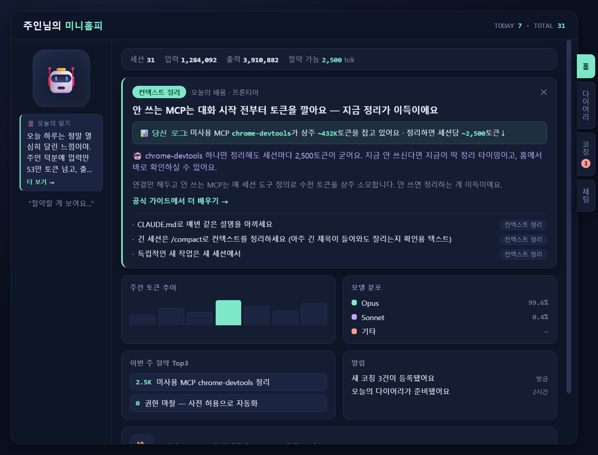

# 콘텐츠 큐레이션(AX 튜터) — client/ 통합 핸드오프

> **목적**: 별도 브랜치(`feat/content-curation`)에서 개발한 "콘텐츠 큐레이션(AX 튜터)"을
> 통합 저장소의 `client/` 구조(앱을 `client/`로 이동한 #24 이후) 위로 이관한 기록.
> 무엇을 얹었는지 + 어떻게 병합했는지 + 검증 결과를 담는다.
> 설계 배경은 [콘텐츠 큐레이션 킥오프](../brainstorming/2026-07-14-content-curation-kickoff.md) 참고.

## 미리보기 — 홈탭 "오늘의 배움" (미니홈피)

좌측 마스코트·일기 카드, 중앙 "오늘의 배움"(📊 내 데이터 근거 + 🤖 LLM 코칭 + 공식 문서 딥링크),
우측 세로 탭, 하단 주간추이·모델분포·절약·알림 위젯. space-a 커뮤니티와 통일(다크 네이비 + 민트).

---

## 0. 30초 요약

- **무엇**: 기존 앱은 로그로 낭비를 *탐지*(R1·R2·R7…)한다. 여기에 **역량을 *성장*시키는 축**을
  얹었다 — 내 로그로 AX 역량 위치를 감지해 **공식 Anthropic 커리큘럼의 다음 단계**만 코칭한다.
- **한 줄 철학**: **커리큘럼 = 지도, 내 로그 = GPS.** 이미 잘하는 건 침묵, 지금 손 뻗으면 닿는 것만.
- **표면**: 홈탭 "오늘의 배움" 카드 — 📊 내 데이터 근거 + 🤖 LLM 코칭 + 공식 문서 딥링크.
- **상태**: `client/` 구조로 이관 완료, **충돌 2파일 해결**, cargo check·239 테스트·실행 검증. ✅

---

## 1. 무엇을 이관했나

| 축 | 내용 |
|---|---|
| 역량 감지 | `profile.rs` — 로그(모델믹스·findings·스킬콜·sidechain) → 5레벨 사다리 위치·프론티어 |
| 팁 카탈로그 | `content.rs` — 내장 팁 19개(공식 docs 딥링크)·스코어링(프론티어 부스트·마스터 억제)·changelog 소식 |
| 저장 | `store.rs` — `content_items` 테이블 + 노출 목록에 **"📊 당신 로그" 근거 줄**(findings·이벤트 수치) |
| 스캔 편승 | `ops.rs`/`pipeline.rs` — `run_curation`(감지→랭킹→persist→`content:ready`) |
| LLM 코칭 | `content.rs::coach_prompt` + `commands::coach_tip` — 내 수치를 녹인 맞춤 한 줄(엔진 미설정 시 근거만) |
| UI | `TipCard.svelte`(오늘의 배움) + `App.svelte`/`theme.css` — space-a 커뮤니티 통일(다크 네이비+민트) |

### 이번 이관에 포함된 개선 (원 브랜치 대비)
- **모델 리터러시 휴리스틱 정밀화**: 상위 모델을 *단순 작업*(짧은 출력)에 남발할 때만 프론티어로.
  실질 작업 위주면 Mastered → 프론티어가 실제 다음 단계로 전진.
- **딥링크**: 강좌 홈(skilljar) → 팁 주제별 공식 문서(`code.claude.com/docs/en/{mcp,memory,hooks,…}`, 200 검증).
- **데이터 접지**: `ContentRow.personal` — 미사용 MCP finding(서버·상주토큰) 등을 카드에 인용.
- **일기 가독성**: 프로필의 긴 일기를 4줄 클램프 카드(더 보기 → 다이어리 탭)로.

---

## 2. main(`client/`) 위로 어떻게 얹었나

- 앱 경로가 원 브랜치는 **루트**, 통합 저장소는 **`client/`** (앱 이동 #24). 공통 git 이력이 없어(orphan)
  일반 `rebase` 불가 → 기능 diff를 `git apply --directory=client --3way`로 재적용.
- **16파일 clean 적용, 2파일 충돌** — 둘 다 main의 *엔진 설정 창*과 우리 *큐레이션*이 같은 영역을 건드림:
  - `src-tauri/src/lib.rs` — `invoke_handler` 명령 목록. **양쪽 유지**(engine_settings_* + coach_tip/list_content/set_content_status).
  - `src-tauri/src/commands.rs` — 함수 추가 위치. **양쪽 유지**(engine 설정 함수 + coach_tip).
- **덤으로 얻은 것**: main `client/`엔 이미 `ureq native-certs`(OS 인증서 신뢰) 수정이 있어,
  우리 changelog 뉴스피드의 사내 프록시 `UnknownIssuer` 실패가 **자동 해결**됨(뉴스 5건 fetch 확인).

---

## 3. 검증

- `cargo check --workspace` 통과(core + agent-mentor-app).
- `cargo test -p agent-mentor` — **239 pass, 0 fail**(모델 휴리스틱·딥링크 매핑·MCP 접지·coach 프롬프트 포함).
- `npm run tauri dev` 실행 — Vite ready, 패닉/에러 없음. 같은 DB(`dev.agentmentor.app`) 사용.
- 뉴스피드: 이전 `UnknownIssuer` → 이제 news 5건 생성(native-certs 효과).

---

## 4. 알려진 것 / 다음

- `.env` 없이도 부팅(다이어리·코칭은 mock/안내로 폴백). main의 **엔진 설정 창**(트레이)으로 URL 지정 가능.
- 원 브랜치의 설계 문서(킥오프·curriculum-catalog·스펙)는 아직 이관 전 — 필요 시 `docs/design/a-mate/`로 별도 이관.
- 리소스 링크(tauri-winres `libresource.a`)는 Windows 빌드에서 빈 import lib로 우회 중(빌드 스크립트 화됨 아님) — 별도 정리 후보.
