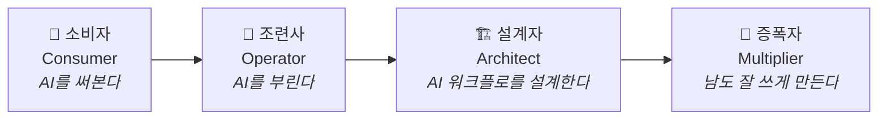
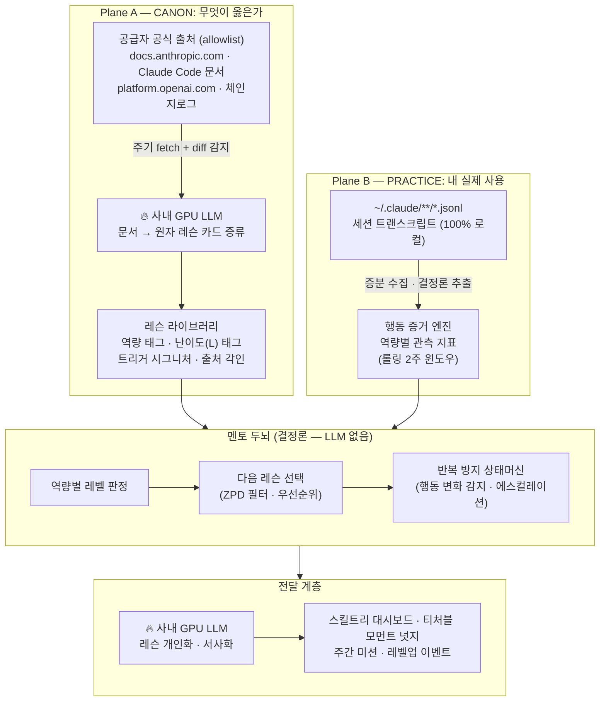
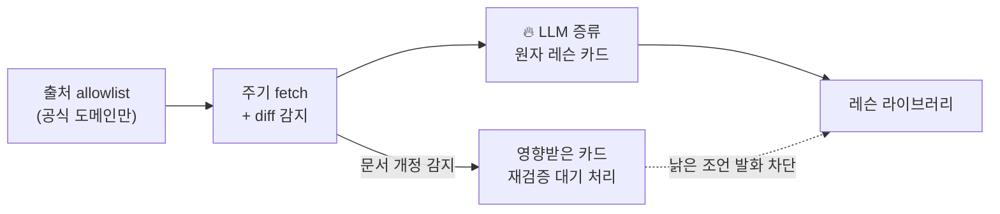
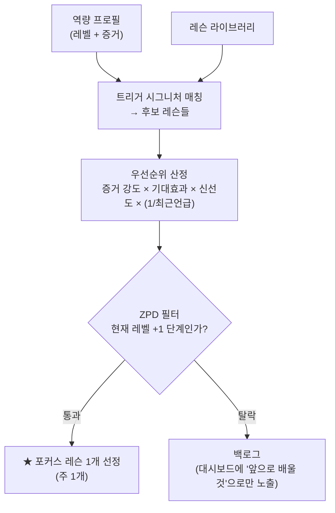
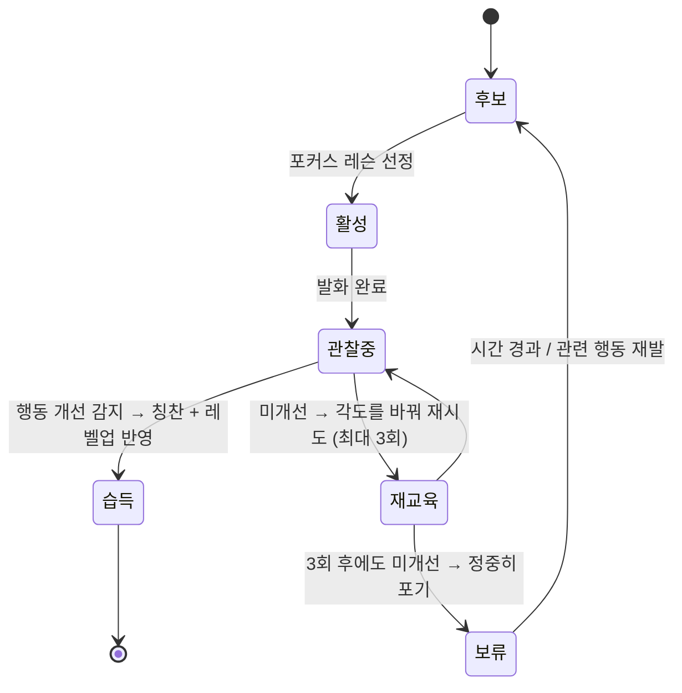
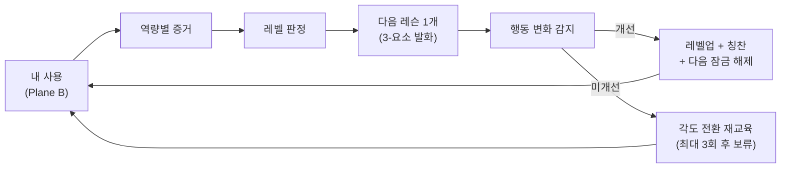

# Chiron — 성장형 AX 멘토 (설계 제안)

> 작성: 2026-07-13 · 상태: **설계 제안 (팀 공유용)**
>
> AI 코딩 에이전트를 잘 쓰는 법을, **공식 문서에서 검증한 지식**으로, **당신의 실제 사용 기록**을 보며,
> **한 단계씩** 가르치는 성장형 로컬 AX 튜터.

---

## 0. 한 줄 요약

**Chiron** — 내 PC에 상주하는 로컬 에이전트가 사내 GPU LLM과 함께 Claude Code 사용 로그를 분석하고,
AI 공급자 공식 문서에서 가져온 검증된 지식으로 **사용자를 AX(AI Transformation) 마스터로 길러내는
커리큘럼 기반 성장형 멘토**.

- **이름 유래**: 카이론(Chiron) — 그리스 신화에서 아킬레우스·아스클레피오스 등 영웅들을 길러낸 전설의 스승.
  "지표를 보여주는 도구"가 아니라 "사람을 길러내는 스승"이라는 정체성.
- 비유하면 **"AI 협업 역량을 위한 듀오링고"** — 내 실력을 레벨로 추적하고,
  다음에 배울 것을 딱 맞게 하나씩 던져주는 커리큘럼 엔진.

---

## 1. 왜 (Why)

### 1.1 개인의 통증 — "쓰고는 있는데, 잘 쓰지는 못한다"

| 통증 | 현상 |
|---|---|
| **비효율적 사용** | Claude Code를 쓰지만 토큰을 막 쓰고 비용이 낭비됨. 잔심부름에 최상위 모델, 같은 파일 반복 읽기, 안 쓰는 MCP가 상주 토큰 소모 |
| **정보의 홍수** | 팁·블로그·영상이 쏟아지는데 무엇이 진짜 올바른 정보인지 판별 불가. 낡은 정보와 검증 안 된 "꿀팁"이 섞여 있음 |
| **긴 글의 장벽** | 공식 베스트프랙티스 문서는 길고, 매번 읽기 힘들고, 읽어도 내 상황과 연결이 안 됨 |

### 1.2 조직의 통증 — AX의 병목은 도구가 아니라 사람

> 회사가 AI 도구에 아무리 투자해도, **AX의 진짜 병목은 '사람의 역량'** 이다.

- 툴을 깔아준다고 AX가 되지 않는다. 대부분의 구성원은 잠재력의 일부만 쓰고, 투자 대비 효과가 나지 않는다
  (= 위 개인 통증의 조직 버전).
- 역량 교육도 실패한다: 일괄 강의는 길고, 일반론이며, 내 실제 사용과 연결되지 않는다.
  들은 다음 주면 원래 습관으로 돌아간다.

### 1.3 기존 도구가 못 채우는 것

| 축 | ccusage 류 (집계) | statusline 류 (실시간 계기판) | **Chiron** |
|---|---|---|---|
| 성격 | 얼마나 썼나 | 지금 세션 상태 | **어떻게 성장할 것인가** |
| 시간축 | 리포트 | 지금 이 순간 | **몇 주·몇 달의 실력 성장 곡선** |
| 지식 | 없음 | 없음 | **공식 문서에서 검증·증류한 커리큘럼** |
| 사용자에게 | 숫자 | 숫자 | **"당신은 지금 이 레벨, 다음은 이걸 배울 차례"** |

숫자를 보여주는 도구는 이미 많다. **숫자를 성장으로 바꿔주는 스승**은 없다.

### 1.4 왜 "성장형·교육형"인가 — 단발 팁의 한계

단순 팁 알림은 실패한다는 것이 이 설계의 출발 전제다.

- 같은 팁이 반복되면 잔소리가 되어 무시된다.
- 내 행동과 무관한 일반론은 행동을 바꾸지 못한다.
- 레벨에 안 맞는 조언(초보에게 고급 기법, 고수에게 기초)은 소음이다.

그래서 Chiron은 **"팁 발송기"가 아니라 "커리큘럼 엔진"** 으로 설계한다.
사용자의 현재 실력을 판정하고, 딱 다음 한 단계를 가르치고, 행동이 바뀌면 칭찬하고 다음을 잠금 해제한다.

---

## 2. 무엇 (What)

### 2.1 제품 정의

> **모든 구성원을 유능한 AI 협업자로 길러내는, 개인 실사용 기반 성장형 AX 튜터.**

- **로컬 상주 에이전트**: 내 PC에서 Claude Code 사용 기록(JSONL 트랜스크립트)을 100% 로컬로 분석.
- **사내 GPU LLM 연동**: 문서 증류·개인화 서사 두 지점에만 LLM 사용 — 데이터가 사내망을 벗어나지 않음.
- **살아있는 지식 베이스**: AI 공급자 공식 문서(allowlist)에서 베스트프랙티스를 주기적으로 fetch·검증·증류.
- **성장 커리큘럼**: AX 역량 스킬트리 + 레벨 판정 + 근접발달영역(ZPD) 기반 "다음 배울 것" 선택.

### 2.2 핵심 재정의 — "Claude Code 팁"이 아니라 "전이 가능한 AX 역량"

레슨의 본질은 툴 조작법이 아니라 **어떤 AI 도구에도 통하는 협업 역량**이다.
Claude Code 사용 로그는 이 역량을 *측정하는 센서*일 뿐이다.

| AX 역량 (전이 가능) | Claude Code 로그에서 관측되는 신호 (예) |
|---|---|
| **작업 위임·분해** — AI에게 일을 맡기는 법 | 플랜 없이 대형 작업 통째로 시작 · 같은 워크플로 반복(스킬화 후보) |
| **산출물 검증** — 맹신하지 않는 법 | 대형 변경 후 테스트/실행 없이 세션 종료 · 에러 무시 후 진행 |
| **컨텍스트 설계** — 맥락을 제대로 주는 법 | 파일 재읽기율 · CLAUDE.md 유무/활용 · 세션당 컨텍스트 낭비 토큰 |
| **의사소통 정밀도** — 명확히 지시하는 법 | 지시 후 재시도·정정 턴 비율 · 권한 거부→승인 마찰 |
| **도구·비용 감각** — 자원을 아는 법 | 모델-작업 매칭률(잔심부름에 Opus?) · 유휴 MCP 상주 비용 · 캐시 히트율 |
| **한계 인지·전략** — 언제 쓰고 언제 안 쓸지 | 단순 작업 과의존 · AI가 헤맬 때 개입 타이밍 |

"컨텍스트를 잘 준다"는 역량은 Claude Code에서도, ChatGPT에서도, 사내 코파일럿에서도 통하는 **AX 근육**이다.
이 재정의 덕분에 Chiron은 "개발자용 툴 팁"을 넘어 **전사 AX 도구**로 확장할 길이 열린다 (§5 비전).

### 2.3 성장 모델 — AX 성숙도 4단계 × 역량 레벨

개인의 여정을 레벨 숫자가 아니라 **AX 성숙도 서사**로 감싼다.

- 각 역량(§2.2의 6개)은 **L0~L5 레벨**을 가지며, 레벨 기준은 **관측 가능한 행동 임계값**이다.
  - 예: 컨텍스트 설계 L3 = "파일 재읽기율 < 15%를 2주 유지 + CLAUDE.md 활용 중"
- **레벨업 = 지속된 행동 변화** (2주 유지). 한 번 잘한 것으로는 올라가지 않는다 → 진짜 습관만 인정.
- 성숙도 단계는 역량 레벨들의 합성으로 산출한다.
- 최종 단계 **증폭자**의 기준에는 스킬 제작·팀 공유 같은 메타 행동이 포함된다 —
  **"AX 마스터 = 남을 성장시키는 사람"** 이라는 메시지.

### 2.4 멘토 품질의 헌법 — "3-요소 규칙"

모든 조언은 아래 3개를 **전부** 갖춰야만 발화된다. 하나라도 없으면 침묵한다.
이것이 "단순 반복 팁"과의 근본적 차이다.

| 요소 | 내용 | 예시 |
|---|---|---|
| ① **내 행동 증거** | 유저의 실제 로그에서 나온 구체 사실 | "어제 `report.xlsx`를 7번 재읽음 (~8k 토큰)" |
| ② **공신력 근거** | 공식 문서 출처 + 버전 + 링크 | "Anthropic 공식: 반복 참조 파일은 CLAUDE.md에 (2026-06 개정)" |
| ③ **기대 효과** | 측정 가능한 개선 예측 | "고치면 주당 ~40k 토큰 절약" |

→ 일반론("컨텍스트를 잘 관리하세요")은 구조적으로 나올 수 없다.
**당신 얘기 + 검증된 근거 + 숫자**만 나온다.

### 2.5 기존 팀 설계(Agent Mentor)와의 관계

본 문서는 [overview-mentor](./overview-mentor/README.md)와 **별개의 독립 제안**이다.
겹치는 기반(트랜스크립트 수집, 로컬 우선, 나깅 방지)이 있으나 무게중심이 다르다.

| 축 | Agent Mentor | **Chiron** |
|---|---|---|
| 정체성 | 저널링 + 코칭 동반자 | **커리큘럼 기반 성장형 튜터** |
| 지식의 출처 | 손으로 짠 결정론적 규칙 (R1~R12) | **공급자 공식 문서에서 fetch·검증한 정전(Canon)** |
| 시간축 | 어제의 회고 (다이어리) | **몇 주·몇 달의 실력 성장 곡선** |
| 사용자에게 | "어제 이거 낭비했어요" | **"당신은 지금 이 레벨, 다음은 이걸 배울 차례"** |
| 성공의 정의 | 토큰 절약 | **사용자의 숙련도 레벨업 (AX 성숙도)** |

두 안은 배타적이지 않다 — 수집 계층은 공유 가능하며, 설계 확정 단계에서 통합/차용을 논의할 수 있다.

---

## 3. 어떻게 (How)

### 3.1 전체 아키텍처 — 2-Plane 구조

**"무엇이 옳은가"(Canon)** 와 **"나는 실제로 어떻게 쓰는가"(Practice)** 를 분리 수집하고,
멘토 두뇌가 둘을 대조하여 가르칠 것을 고른다.

- 🔥 = 사내 GPU LLM이 개입하는 **딱 2곳** (증류 · 개인화). 판단은 전부 결정론.
- **정밀도의 선**: 사실·레벨·레슨 선택은 증거와 검증된 Canon에서만 나온다.
  LLM은 표현만 생성한다 → **환각이 판정·처방에 들어올 수 없는 구조.**

### 3.2 Plane B — 행동 증거 엔진

결정론 추출기가 JSONL 트랜스크립트에서 **역량별 관측 지표**를 뽑는다. LLM 없음, 100% 로컬.

- **수집**: `~/.claude/projects/**/*.jsonl` 파일 감시 → 증분 수집(파일별 offset 워터마크) → 정규화 이벤트로 변환.
- **추출 지표 (예)**: 파일 재읽기율, 플랜-퍼스트 비율, 변경 후 검증 비율, 모델-작업 매칭률,
  재시도·정정 턴 비율, 유휴 MCP 상주 비용, 캐시 히트율, 반복 워크플로 패턴.
- **판정 신뢰 장치**: 지표는 **롤링 2주 윈도우 + 최소 표본** (예: 세션 10개 미만이면 판정 유보).
  세션 2개를 보고 훈수 두지 않는다.
- **프라이버시**: 대화 원문(프로즈)은 DB에 저장하지 않는다. 지표·미리보기·원본 포인터만 저장.

### 3.3 Plane A — 지식 파이프라인 (공신력의 원천)

**레슨 카드의 구조** — 증류 시 반드시 채워야 하는 필드:

| 필드 | 내용 |
|---|---|
| claim | 한 문장 주장 (예: "반복 참조하는 파일은 CLAUDE.md에 기재하라") |
| why / how | 근거 요약 + 실행 방법 (한 입 크기) |
| 역량 태그 | §2.2의 6대 역량 중 하나 |
| 난이도 태그 | L1~L5 — ZPD 필터의 입력 |
| **트리거 시그니처** | 어떤 행동 지표 패턴일 때 이 레슨이 관련되는가 (예: `재읽기율 > 25%`) |
| **출처 각인** | 출처 URL + 문서 버전 + fetch 날짜 — 모든 발화에 표시 |

**공신력 보장 3장치**:
1. **allowlist** — 공식 도메인만. 블로그·랜덤 팁 배제.
2. **출처 각인** — "이 조언은 어디서 왔는가"를 항상 표시.
3. **신선도 검증** — 재fetch에서 원문 개정이 감지되면 영향받은 카드를 재검증 대기로 전환.
   낡은 조언이 나가는 것을 구조적으로 차단.

### 3.4 멘토 두뇌 — 커리큘럼 정책 ("다음에 뭘 가르칠까")

- **ZPD(근접발달영역) 필터**: 지금 레벨 바로 위 것만 가르친다.
  초보에게 서브에이전트 얘기를 하지 않고, 고수에게 CLAUDE.md 만들라고 하지 않는다.
- **포커스 레슨은 동시 1개**: 코치가 드릴을 하나씩 주듯. 잔소리 폭탄 원천 차단.
- 나머지 후보는 백로그 — 대시보드에서 "앞으로 배울 것"으로만 보인다
  (잠금 해제 예고 = 게임 스킬트리의 동기부여 문법).

### 3.5 반복 방지 기계 — 레슨 상태머신

"의미있고 반복되지 않는 멘토"를 감성이 아니라 **메커니즘**으로 보장하는 부분.

| 장치 | 동작 |
|---|---|
| **행동 변화 감지** | 레슨 전/후 지표 윈도우 비교. 개선됨 → 즉시 **칭찬으로 전환** 후 은퇴. "지난주에 말한 재읽기, 이번 주 22%→9%. 이거예요." |
| **에스컬레이션 사다리** | 안 바뀌면 같은 말 반복 금지 — **각도를 바꾼다**: ① 팁 → ② 내 세션 실례로 시연 → ③ 측정 가능한 주간 미션. 3회 후에도 안 되면 **정중히 보류** ("이건 나중에 다시 얘기해요") |
| **전역 어텐션 예산** | 실시간 넛지 하루 최대 1회 · 포커스 레슨 주 1개 · 나머지는 유저가 열어볼 때만 |
| **dedup + 쿨다운** | 같은 (역량, 문제) 조합은 카드 1장에 병합, 발화에는 전역 쿨다운 |

→ "잔소리 봇"이 아니라 **"내 코치가 지켜보다가, 딱 필요할 때 한 마디"** 가 되는 이유가 전부 이 상태머신이다.

### 3.6 전달 리듬 — 언제, 어떤 모양으로

| 리듬 | 트리거 | 형태 |
|---|---|---|
| **티처블 모먼트** (실시간, 희소) | 포커스 레슨 관련 행동이 **방금** 일어났을 때만 | "방금 그 파일 오늘 3번째 읽었어요" 한 줄 넛지 |
| **데일리** | 하루 1회 | 어제의 한 컷: 증거 1 + 진행도 — 30초 카드 (긴 글 통증 해결) |
| **위클리 미션** | 주 1회 | "이번 주: 잔심부름의 Haiku 비율 12%→40%" — 측정 가능한 목표 + 주말 리뷰 |
| **레벨업 이벤트** | 지속 개선 확인 시 | 축하 + 다음 역량 잠금 해제 + 성숙도 갱신 |

전달 문구는 사내 GPU LLM이 레슨 카드 + 내 증거 브리프만 받아 개인화·서사화한다
(트랜스크립트 원문은 절대 전달하지 않음).

### 3.7 성장 루프 (전체 사이클)

한 번에 하나씩, 준비된 것만 가르쳐서 "잔소리 폭탄"이 아니라 **성장 경험**이 되게 한다.

### 3.8 사내 GPU LLM의 역할 경계

| 지점 | 입력 | 출력 | 왜 LLM인가 |
|---|---|---|---|
| ① 문서 증류 (수집 시) | 공식 문서 원문 | 원자 레슨 카드(구조화 JSON) | 긴 문서 → 한 입 크기 카드화는 언어 이해 필요 |
| ② 개인화 서사 (전달 시) | 레슨 카드 + 증거 브리프 | 멘토 화법의 발화문 | 같은 레슨도 내 상황의 언어로 말해야 행동이 바뀜 |

- **이 2곳 외에 LLM 없음.** 레벨 판정·레슨 선택·반복 방지는 전부 결정론 →
  환각이 판단에 들어올 수 없고, GPU 비용이 예측 가능하다.
- 기본 엔진은 **사내 on-prem (OpenAI 호환 엔드포인트)** — 데이터가 사내망을 벗어나지 않는다.

### 3.9 프라이버시 원칙

1. 트랜스크립트 원문은 **절대 망 밖으로 나가지 않는다** (로컬 분석 + 사내 GPU엔 증류된 브리프만).
2. 대화 원문은 DB에도 저장하지 않는다 — 지표 + 원본 파일 포인터만.
3. (비전) 조직 뷰는 **옵트인 + 익명 집계된 역량 지표만** — 개인 세션 내용은 구조적으로 올라갈 수 없다.

---

## 4. 해커톤 데모 슬라이스

전체는 비전으로 그리되, **실제로 만들어 보여줄 최소 핵심**은 아래로 한정한다.

### 4.1 범위

| 포함 | 제외 (비전으로만) |
|---|---|
| 역량 2개: **컨텍스트 설계** + **도구·비용 감각(모델 라우팅)** | 나머지 4개 역량 |
| Claude Code 어댑터 1개 | 타 도구 어댑터 |
| 레슨 카드 증류 (공식 문서 1~2편) | 전체 Canon 파이프라인 · 재검증 자동화 |
| 레벨 판정 + 포커스 레슨 + 상태머신 핵심 경로 | 전체 스킬트리 UI · 조직 레이어 |

선정 이유: 두 역량 모두 트랜스크립트에서 **결정론 감지가 쉽고** (재읽기 카운트, 모델×작업 매칭),
데모에서 "아하"가 강하다.

### 4.2 데모 시나리오 (4막)

1. **Canon 시연** — Anthropic 공식 문서 2편 fetch → 사내 GPU LLM이 레슨 카드로 증류하는 과정 표시
   (출처 각인 강조).
2. **Practice 시연** — 실제 트랜스크립트 스캔 → 역량 프로필 + AX 성숙도 판정 화면.
3. **두뇌 시연** — 포커스 레슨 1개가 **3-요소**(내 증거 + 출처 + 숫자)로 발화.
4. **피날레: 성장 루프** — 개선된 세션 데이터 주입 → 행동 변화 감지 → **칭찬 전환 + 레벨업 연출**.

### 4.3 요구사항 ↔ 설계 장치 대응표

| 요구 | 이를 보장하는 설계 장치 |
|---|---|
| 공신력 있는 정보 | 출처 allowlist + 출처 각인 + 신선도 재검증 (§3.3) |
| 유저 행동 기반 | 3-요소 규칙이 증거 없는 발화를 구조적으로 차단 (§2.4) |
| AX 마스터로 성장 | 성숙도 4단계 + 역량 레벨 + ZPD 커리큘럼 (§2.3, §3.4) |
| 반복되지 않는 의미있는 팁 | 레슨 상태머신 + 에스컬레이션 + 어텐션 예산 (§3.5) |

---

## 5. 확장 비전 (해커톤 이후)

1. **센서 확장 — 멀티 도구 어댑터**: 수집을 어댑터 인터페이스 뒤로 추상화.
   Claude Code → OpenCode/Codex → 사내 AI 도구 순으로 확장하면
   "개발자용"을 넘어 **전 구성원의 AX 튜터**가 된다.
2. **조직 AX 레이어**: 개인 성장 위에 조직의 AI 역량 지도를 얹는다 —
   어느 역량이 조직에 약한지, AX가 어디서 막혔는지.
   개인 트랜스크립트는 PC를 벗어나지 않고, **옵트인·익명 집계된 역량 지표만** 조직 뷰로.
   개인 레벨업 → 조직 AX 성숙도로 집계.
3. **증폭자 단계의 사회적 기능**: 검증된 개인 노하우(반복 워크플로→스킬화 등)를
   팀 레슨 카드로 승격하는 경로 — 조직 지식이 Canon에 합류.

---

## 6. 열린 질문 (팀 논의용)

1. **레벨 임계값의 초기 캘리브레이션** — L0~L5 기준을 무엇으로 시작할 것인가?
   (초기엔 보수적으로 잡고 파일럿 데이터로 조정하는 안을 제안)
2. **Agent Mentor와의 수집 계층 공유 여부** — 트랜스크립트 수집·정규화는 두 안이 사실상 동일하다.
   공용 크레이트로 분리할 것인가?
3. **셸 형태** — 트레이 상주 데스크톱 앱 vs CLI + 웹 대시보드.
   데모 임팩트는 전자, 해커톤 구현 속도는 후자가 유리.
4. **사내 GPU 엔드포인트 스펙** — 사용 가능한 모델·컨텍스트 길이·처리량 확인 필요
   (증류 품질의 하한을 결정).
